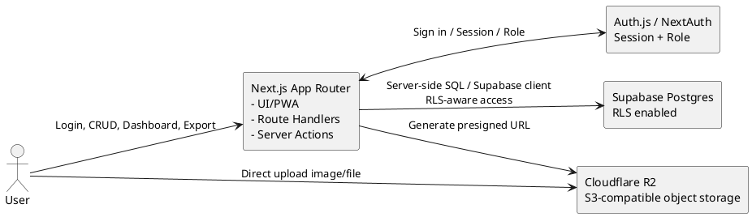
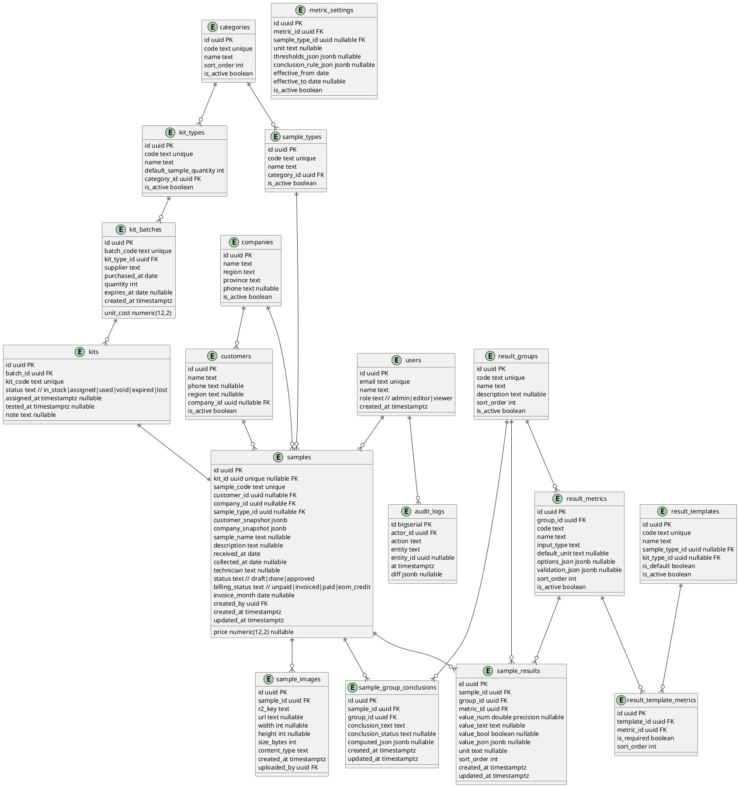

# SPEC-001 — Quản lý mẫu phòng lab đơn giản

**Stack MVP chính thức:** Bun + Next.js App Router + Supabase Postgres + Cloudflare R2 + Auth.js  
**Backend MVP:** Next.js Route Handlers / Server Actions, không dùng Go trong MVP  
**Triển khai:** Vercel  
**Ngôn ngữ giao diện:** Tiếng Việt  
**Đối tượng sử dụng:** 5–7 user nội bộ phòng lab

---

## 1. Background

Cần xây dựng một web app nội bộ để quản lý mẫu phòng lab theo dạng bảng, nhập liệu bằng form, lưu kết quả xét nghiệm theo nhóm chỉ tiêu, upload ảnh minh chứng, phân tích/pivot, xuất Excel/CSV và dùng tốt trên điện thoại.

Hệ thống ban đầu có nhu cầu quản lý danh sách KIT là trọng tâm. Khi test xong, người dùng điền thông tin thành mẫu/kết quả. UI cần tạo cảm giác như một bảng dữ liệu thống nhất, nhưng schema phải chuẩn hóa để dễ mở rộng nhóm kết quả/chỉ tiêu sau này.

Ưu tiên của MVP:

- Triển khai nhanh, ít rủi ro.
- Dễ cho AI coding agent thực hiện theo phase.
- Không hard-code danh sách chỉ tiêu vào code.
- Hỗ trợ form nhập liệu động theo cấu hình.
- Dễ mở rộng thêm nhóm/chỉ tiêu/ngưỡng sau MVP.

---

## 2. Quyết định kiến trúc chính thức cho MVP

### 2.1. Chọn Phương án A

MVP sử dụng:

- **Bun**: package manager/runtime tooling cho frontend.
- **Next.js App Router**: frontend + backend API trong cùng codebase.
- **Route Handlers / Server Actions**: xử lý API nội bộ thay cho Go serverless.
- **Supabase Postgres**: database quan hệ.
- **Supabase RLS**: bảo vệ dữ liệu ở tầng database.
- **Auth.js / NextAuth**: đăng nhập, session, role.
- **Cloudflare R2**: lưu ảnh/file đính kèm qua presigned upload URL.
- **TanStack Table v8**: grid dữ liệu.
- **React Hook Form + Zod**: form + validation.
- **ECharts**: biểu đồ/dashboard.
- **SheetJS hoặc thư viện export tương đương**: xuất Excel/CSV.

### 2.2. Loại khỏi MVP

Không dùng Go trong MVP.

Go chỉ giữ làm **Phase sau** nếu cần:

- export Excel rất lớn;
- pivot/report nặng;
- import file lớn;
- batch processing;
- tách backend độc lập khỏi Next.js.

### 2.3. Lý do đổi khỏi Go trong MVP

Yêu cầu hiện tại tập trung vào:

- form động theo nhóm/chỉ tiêu;
- cấu hình kiểu nhập liệu động;
- cấu hình ngưỡng/setting thay đổi thường xuyên;
- nhập liệu mobile-first;
- grid/export/pivot vừa đủ cho 5–7 user.

Các phần này phù hợp hơn với Next.js-only backend vì giảm số lượng runtime, giảm lỗi deploy, dễ chia sẻ TypeScript type giữa UI/API, và thuận lợi cho AI coding agent.

---

## 3. Scope MVP

### 3.1. Must have

- Quản lý KIT/lô KIT/tồn kho KIT.
- Quản lý mẫu với 20–30 trường metadata.
- Mỗi mẫu có nhiều nhóm kết quả.
- Mỗi nhóm có nhiều chỉ tiêu.
- Mỗi chỉ tiêu có kiểu nhập liệu riêng: số, text, textarea, select, boolean, scale 1–5, %, PCR qualitative, PCR realtime.
- Upload tối đa 10 ảnh/mẫu, mỗi ảnh tối đa 5 MB.
- Bảng dữ liệu có filter/sort/search, ẩn/hiện cột.
- Form nhập liệu responsive/mobile-first.
- KQ_CHUNG theo từng nhóm.
- Dashboard/pivot cơ bản.
- Export Excel/CSV.
- RBAC 3 mức: Admin, Editor, Viewer.
- Audit trail nhẹ.
- RLS cho các bảng chính.

### 3.2. Should have

- Autosave draft cho form nhập mẫu.
- Template form theo loại mẫu/loại kit.
- File đính kèm PDF/CSV ngoài ảnh.
- Report view cho mẫu đã duyệt.

### 3.3. Could have

- Tạo report PDF.
- Comment nội bộ.
- Mention user.
- Import Excel/CSV.
- Offline cache read-only cho dashboard/PWA.

### 3.4. Won’t have trong MVP

- Go backend.
- LIMS integration phức tạp.
- SSO doanh nghiệp.
- Quy trình duyệt đa cấp.
- Tự động lấy dữ liệu từ máy đo realtime.
- Cronjob/worker phức tạp.
- Naup/Art evaluation.

---

## 4. Role & Permission

### 4.1. Roles

| Role | Mô tả |
|---|---|
| Admin | Quản trị hệ thống, cấu hình nhóm/chỉ tiêu/template/setting, quản lý user |
| Editor | Nhập/sửa mẫu, nhập kết quả, upload ảnh/file, tạo export |
| Viewer | Chỉ xem dữ liệu, hình ảnh, dashboard, report |

### 4.2. Permission matrix

| Chức năng | Admin | Editor | Viewer |
|---|---:|---:|---:|
| Xem mẫu | Có | Có | Có |
| Tạo/sửa mẫu | Có | Có | Không |
| Xóa mẫu | Có | Không mặc định | Không |
| Nhập kết quả | Có | Có | Không |
| Upload ảnh/file | Có | Có | Không |
| Duyệt mẫu | Có | Có nếu được bật quyền | Không |
| Export Excel/CSV | Có | Có | Có nếu được bật |
| Quản lý nhóm kết quả | Có | Không | Không |
| Quản lý chỉ tiêu | Có | Không | Không |
| Quản lý template | Có | Không | Không |
| Quản lý ngưỡng/setting | Có | Không | Không |
| Quản lý user/role | Có | Không | Không |

---

## 5. Kiến trúc tổng quan

### 5.1. Thành phần



### 5.2. Repository structure

```txt
lab-kit-app/
├── app/
│   ├── (auth)/
│   ├── (dashboard)/
│   │   ├── samples/
│   │   ├── kits/
│   │   ├── result-config/
│   │   ├── analytics/
│   │   └── settings/
│   ├── api/
│   │   ├── auth/[...nextauth]/route.ts
│   │   ├── samples/route.ts
│   │   ├── samples/[id]/route.ts
│   │   ├── samples/[id]/results/route.ts
│   │   ├── samples/[id]/images/route.ts
│   │   ├── kits/route.ts
│   │   ├── kit-batches/route.ts
│   │   ├── result-groups/route.ts
│   │   ├── result-metrics/route.ts
│   │   ├── result-templates/route.ts
│   │   ├── metric-settings/route.ts
│   │   ├── uploads/presign/route.ts
│   │   ├── analytics/pivot/route.ts
│   │   └── export/route.ts
│   ├── layout.tsx
│   └── page.tsx
├── components/
│   ├── ui/
│   ├── forms/
│   ├── tables/
│   ├── charts/
│   └── result-entry/
├── lib/
│   ├── auth/
│   ├── db/
│   ├── r2/
│   ├── validation/
│   ├── permissions/
│   ├── audit/
│   └── result-engine/
├── types/
├── supabase/
│   ├── migrations/
│   └── seed.sql
├── tests/
├── package.json
├── tsconfig.json
├── eslint.config.mjs
└── next.config.ts
```

---

## 6. Data model

### 6.1. Core entities



### 6.2. Input types bắt buộc hỗ trợ

| input_type | Ý nghĩa | Ví dụ |
|---|---|---|
| number | Nhập số | pH, DO, TAN, mật độ khuẩn |
| text | Text ngắn | Màu sắc, ghi chú ngắn |
| textarea | Text dài | Yếu tố khác, kết luận |
| select | Chọn một giá trị | Hình thái, màu sắc, mức đánh giá |
| multi_select | Chọn nhiều giá trị | Nhiều biểu hiện bất thường |
| boolean | Có/Không | Có ký sinh trùng, có hoại tử |
| scale_1_5 | Thang 1–5 | Đánh giá chất lượng gan/ruột |
| percent | Tỷ lệ % | Tỉ lệ cơ ruột đốt thứ 6 |
| pcr_qualitative | Âm tính/Dương tính | PCR thường |
| pcr_realtime | Âm/Dương tính + CT nullable | PCR realtime |

### 6.3. Quy tắc CT

- CT chỉ nhập khi chỉ tiêu có dữ liệu CT.
- CT nullable.
- Không bắt buộc CT cho tất cả chỉ tiêu PCR.
- Với `pcr_realtime`, trạng thái âm/dương tính là dữ liệu chính; CT là dữ liệu bổ sung.

### 6.4. KQ_CHUNG theo từng nhóm

KQ_CHUNG không còn là một trường duy nhất áp cho toàn bộ mẫu.

Mỗi mẫu có thể có nhiều `sample_group_conclusions`, mỗi record tương ứng một nhóm kết quả.

Quy tắc nhóm PCR:

- Nếu tất cả chỉ tiêu PCR là âm tính hoặc không phát hiện → `SẠCH`.
- Nếu có ít nhất một chỉ tiêu PCR dương tính → `NHIỄM`.
- CT không tự làm thay đổi KQ_CHUNG nếu trạng thái vẫn âm tính.

Các nhóm khác:

- KQ_CHUNG là trường `Kết luận` dạng text do người nhập hoặc người duyệt ghi.
- Có thể bổ sung rule gợi ý sau này dựa trên `metric_settings`, nhưng MVP không bắt buộc tự kết luận tự động cho mọi nhóm.

---

## 7. Danh mục nhóm/chỉ tiêu mặc định

### 7.1. Nhóm PCR

Các chỉ tiêu thuộc nhóm PCR vì dùng kit PCR để test.

- WSSV
- MBV
- DIV1
- EHP
- EMS
- Khuẩn (Vibrio)
- PDD
- TPD
- Nội ký sinh
- Dạng khác
- Vi khuẩn tổng
- Vi nấm

Kiểu nhập mặc định:

- `pcr_qualitative` hoặc `pcr_realtime` tùy chỉ tiêu/template.
- CT nullable.
- EMS chỉ có 1 loại.

### 7.2. Nhóm Vi Khuẩn - TCBS

- Khuẩn vàng
- Khuẩn xanh
- Phát sáng
- H2S

Kiểu nhập mặc định:

- `number`
- Đơn vị: `CFU/ml` hoặc `CFU/g` tùy loại mẫu.

### 7.3. Nhóm Vi Khuẩn - ChromAgar

- Khuẩn trắng
- Khuẩn xanh
- Khuẩn tím
- Phát sáng

Kiểu nhập mặc định:

- `number`
- Đơn vị: `CFU/ml` hoặc `CFU/g` tùy loại mẫu.

### 7.4. Nhóm Chất lượng nước

- Độ mặn
- pH
- Kiềm / kH
- Độ cứng / gH
- DO
- Chlorin
- Ca
- Mg
- Kali
- TAN (NH3/NH4+)
- Nitrat (NO3-)
- Nitrit (NO2-)
- Fe
- TDS
- DOC

Kiểu nhập mặc định:

- `number`
- Đơn vị/ngưỡng lưu trong `metric_settings`.
- Admin có thể chỉnh thường xuyên.
- Giá trị seed ban đầu chỉ là khuyến nghị để tham khảo, không khóa cứng.

### 7.5. Nhóm Chất lượng gan tôm

- Kích thước
- Màu sắc
- Lipid
- Tubular
- Melaninzation
- Vermiform
- Gregarine
- Yếu tố khác

Kiểu nhập mặc định:

- Tùy chỉ tiêu: `text`, `select`, `scale_1_5`, `boolean`, hoặc `%`.
- Cấu hình cụ thể nằm trong `result_metrics.options_json` và `metric_settings`.

### 7.6. Nhóm Chất lượng ruột tôm

- Hình thái
- Kích thước
- Thành biểu mô
- Sắc tố thành ruột
- Ký sinh trùng bên trong
- Yếu tố khác

Kiểu nhập mặc định:

- Tùy chỉ tiêu: `text`, `select`, `scale_1_5`, `boolean`, hoặc `%`.

### 7.7. Nhóm Chất lượng tảo

- Mật độ tảo tổng
- Tảo Lục
- Tảo Lam
- Tảo Khuê
- Tảo Giáp
- Tảo Mắt
- Động vật phù du
- Yếu tố khác

Kiểu nhập mặc định:

- Mật độ/tỷ lệ: `number` hoặc `percent`.
- Yếu tố khác: `textarea`.

### 7.8. Nhóm Đánh giá bên ngoài - phụ bộ

- Ngoại ký sinh (Fouling organism)
- Hoại tử (necrosis)
- Đột biến (deform)
- Độ toàn vẹn phụ bộ
- Màu sắc
- Tỉ lệ cơ ruột đốt thứ 6

Kiểu nhập mặc định:

- Tùy chỉ tiêu: `boolean`, `select`, `scale_1_5`, `percent`, hoặc `text`.

### 7.9. Chưa đưa vào MVP

- Đánh giá chất lượng Naup.
- Đánh giá chất lượng Art.

Lý do: hiện chưa có mẫu đánh giá thực tế, chỉ giữ khả năng mở rộng sau.

---

## 8. Metric settings/ngưỡng đánh giá

### 8.1. Yêu cầu

Mỗi chỉ tiêu có thể có:

- đơn vị mặc định;
- min/max hợp lệ;
- ngưỡng tốt/cảnh báo/nguy hiểm;
- rule gợi ý kết luận;
- hiệu lực theo thời gian.

Vì ngưỡng có thể thay đổi thường xuyên, không hard-code trong code.

### 8.2. Lưu trữ

Dùng bảng `metric_settings`.

Ví dụ `thresholds_json`:

```json
{
  "normal": { "min": 7.5, "max": 8.5 },
  "warning": [
    { "min": 7.0, "max": 7.49 },
    { "min": 8.51, "max": 9.0 }
  ],
  "danger": [
    { "lt": 7.0 },
    { "gt": 9.0 }
  ]
}
```

### 8.3. Seed ngưỡng chất lượng nước

Agent có thể seed ngưỡng gợi ý ban đầu cho nhóm Chất lượng nước, nhưng phải ghi rõ trong seed/comment:

- Đây là giá trị khởi tạo tham khảo.
- Admin phải rà soát và chỉnh theo quy trình lab, loài nuôi, giai đoạn nuôi, loại mẫu.
- Không dùng seed để khẳng định tiêu chuẩn chuyên môn tuyệt đối.

---

## 9. UI/UX requirements

### 9.1. Mobile-first

Breakpoint chính:

- `< 1024px`: mobile/tablet layout.
- `>= 1024px`: desktop/table layout.

Nguyên tắc:

- Không bung hàng chục cột kết quả trên mobile.
- Ưu tiên card/accordion.
- Hiển thị tiến độ nhập liệu theo nhóm.
- Giữ CTA chính luôn dễ bấm.

### 9.2. Form nhập mẫu

Form gồm các vùng:

1. Thông tin mẫu.
2. Thông tin khách hàng/công ty.
3. Thông tin KIT.
4. Kết quả xét nghiệm theo nhóm.
5. Ảnh/file minh chứng.
6. Thanh toán/trạng thái.

Phần kết quả xét nghiệm:

- Mỗi nhóm là một accordion/card.
- Card hiển thị:
  - tên nhóm;
  - số chỉ tiêu đã nhập/tổng số chỉ tiêu;
  - trạng thái KQ_CHUNG của nhóm;
  - số chỉ tiêu dương tính/bất thường nếu có.
- Field được render theo `input_type`.
- Validation lấy từ `validation_json` và `metric_settings`.

### 9.3. Grid dữ liệu

Cần có 3 chế độ:

- **Compact mode**: hiển thị metadata, status, KQ_CHUNG từng nhóm.
- **Group detail mode**: mở rộng một mẫu để xem chỉ tiêu theo nhóm.
- **Column mode**: desktop cho phép chọn nhóm/chỉ tiêu muốn bung thành cột.

### 9.4. Dashboard/pivot

MVP cần có:

- số mẫu theo thời gian;
- số mẫu theo khách hàng/công ty;
- số mẫu theo loại mẫu/loại kit;
- tỉ lệ PCR SẠCH/NHIỄM;
- thống kê dương tính theo chỉ tiêu PCR;
- thống kê nhóm vi khuẩn theo khoảng giá trị;
- export kết quả pivot.

Pivot API không nhận raw SQL từ client.

---

## 10. API requirements

Tất cả API nằm trong `app/api/**/route.ts`.

### 10.1. Samples

```http
GET    /api/samples
POST   /api/samples
GET    /api/samples/:id
PATCH  /api/samples/:id
DELETE /api/samples/:id
GET    /api/samples/next-code
```

### 10.2. Sample results

```http
GET /api/samples/:id/results
PUT /api/samples/:id/results
```

`PUT` phải ghi theo transaction logic:

1. validate quyền;
2. validate sample tồn tại;
3. validate metric thuộc template hợp lệ;
4. upsert sample_results;
5. cập nhật sample_group_conclusions;
6. ghi audit log.

### 10.3. Kits

```http
GET   /api/kit-batches
POST  /api/kit-batches
GET   /api/kits
POST  /api/kits/assign-next
PATCH /api/kits/:id
POST  /api/kits/bulk-adjust
```

Assign kit tự động phải xử lý tránh lấy trùng kit.

### 10.4. Result config

```http
GET    /api/result-groups
POST   /api/result-groups
PATCH  /api/result-groups/:id

GET    /api/result-metrics?groupId=...
POST   /api/result-metrics
PATCH  /api/result-metrics/:id

GET    /api/result-templates
POST   /api/result-templates
PATCH  /api/result-templates/:id

GET    /api/result-templates/:id/metrics
PUT    /api/result-templates/:id/metrics

GET    /api/metric-settings?metricId=...
POST   /api/metric-settings
PATCH  /api/metric-settings/:id
```

Chỉ Admin được tạo/sửa nhóm, chỉ tiêu, template, setting.

### 10.5. Upload

```http
POST /api/uploads/presign
POST /api/samples/:id/images
DELETE /api/samples/:id/images/:imageId
```

Rules:

- Tối đa 10 ảnh/mẫu.
- Ảnh tối đa 5 MB.
- Content type: `image/jpeg`, `image/png`, `image/webp`.
- Không upload file qua Next.js server; client upload trực tiếp R2 qua presigned URL.
- Không log presigned URL.

### 10.6. Analytics/export

```http
POST /api/analytics/pivot
POST /api/export/samples
POST /api/export/results-normalized
```

Rules:

- Whitelist rows/cols/metrics/filters.
- Không nhận raw SQL.
- Dataset lớn phải phân trang/lọc bắt buộc.

---

## 11. RLS & Security

### 11.1. Nguyên tắc

- RLS bật cho tất cả bảng chính.
- App layer vẫn check permission trước để trả lỗi 403 rõ ràng.
- Không dùng service role key trong client.
- Nếu dùng service role ở server cho tác vụ admin nội bộ, phải bọc permission check nghiêm ngặt và không expose ra client.
- Không log JWT, password, secret, presigned URL, PII không cần thiết.

### 11.2. Audit trail

Ghi log cấp cao:

- VIEW
- CREATE
- UPDATE
- DELETE
- APPROVE
- EXPORT
- UPLOAD
- CONFIG_CHANGE

Không ghi diff chứa ảnh/base64, token, secret, hoặc PII nhạy cảm không cần thiết.

---

## 12. Roadmap / Milestones cho AI coding agent

Nguyên tắc chia phase:

- Mỗi phase phải tạo được trạng thái app chạy được.
- Không phase nào nên ôm quá nhiều domain cùng lúc.
- Mỗi phase có acceptance criteria và quality gates riêng.
- Không chuyển phase nếu quality gates chưa xanh.

---

### Phase 0 — Project foundation & quality gates

**Mục tiêu:** dựng nền Next.js chuẩn, cấu hình công cụ kiểm tra chất lượng trước khi code nghiệp vụ.

**Tasks:**

- Khởi tạo Next.js App Router với TypeScript.
- Cấu hình Bun.
- Cấu hình Tailwind + shadcn/ui.
- Cấu hình ESLint.
- Cấu hình Prettier nếu dùng.
- Cấu hình `tsconfig` strict.
- Cấu hình rule cấm `any`.
- Cấu hình script quality gates.
- Tạo layout dashboard rỗng.
- Tạo trang healthcheck đơn giản.

**Package scripts bắt buộc:**

```json
{
  "scripts": {
    "dev": "next dev",
    "build": "next build",
    "typecheck": "tsc --noEmit",
    "lint": "next lint",
    "lint:strict": "eslint . --max-warnings=0",
    "format:check": "prettier --check .",
    "react:doctor": "npx react-scan@latest ./app ./components",
    "quality": "bun run typecheck && bun run lint:strict && bun run format:check && bun run build"
  }
}
```

Nếu không dùng Prettier hoặc `react-scan`, phải thay bằng công cụ tương đương và ghi rõ trong README.

**ESLint rules bắt buộc:**

- `@typescript-eslint/no-explicit-any`: error.
- `@typescript-eslint/no-unused-vars`: error, cho phép prefix `_` nếu cần.
- `react-hooks/rules-of-hooks`: error.
- `react-hooks/exhaustive-deps`: warn hoặc error.
- Không suppress lint bằng comment nếu không có lý do.

**Acceptance criteria:**

- App chạy được.
- Trang dashboard shell hiển thị.
- `bun run quality` pass.
- Không có `any` trong code mới.

**Quality gates:**

```bash
bun run typecheck
bun run lint:strict
bun run format:check
bun run build
```

---

### Phase 1 — Database schema, migrations & seed master data

**Mục tiêu:** tạo schema nền và seed danh mục mặc định.

**Tasks:**

- Tạo migrations cho các bảng:
  - users
  - categories
  - kit_types
  - sample_types
  - companies
  - customers
  - kit_batches
  - kits
  - samples
  - result_groups
  - result_metrics
  - result_templates
  - result_template_metrics
  - metric_settings
  - sample_results
  - sample_group_conclusions
  - sample_images
  - audit_logs
- Tạo constraints/check constraints cho status/role/input_type.
- Tạo indexes cho các cột truy vấn thường dùng.
- Seed nhóm/chỉ tiêu mặc định.
- Seed template mặc định.
- Seed metric_settings mẫu cho Chất lượng nước ở mức tham khảo.
- Bật RLS cho tất cả bảng chính.
- Tạo RLS policies cơ bản theo role.

**Acceptance criteria:**

- Migration chạy sạch trên database mới.
- Seed chạy idempotent.
- Có thể query danh mục nhóm/chỉ tiêu/template.
- Không còn hard-code metric list trong UI/API.

**Quality gates:**

```bash
bun run typecheck
bun run lint:strict
bun run build
```

Nếu có test migration:

```bash
bun run db:test
```

---

### Phase 2 — Auth, session, RBAC & app shell

**Mục tiêu:** đăng nhập, session, phân quyền và route guard.

**Tasks:**

- Cấu hình Auth.js/NextAuth.
- Tạo role `admin`, `editor`, `viewer`.
- Tạo helper `getCurrentUser()`.
- Tạo helper `requireRole()`.
- Tạo middleware/guard cho dashboard routes.
- Tạo sidebar/topbar responsive.
- Tạo trang Unauthorized/Forbidden.
- Hiển thị UI theo role.

**Acceptance criteria:**

- User chưa login không vào được dashboard.
- Viewer không thấy nút thêm/sửa/xóa.
- Editor không thấy màn hình cấu hình nhóm/chỉ tiêu.
- Admin thấy menu cấu hình.
- Permission check có ở server, không chỉ ở frontend.

**Quality gates:**

```bash
bun run typecheck
bun run lint:strict
bun run build
```

---

### Phase 3 — Result configuration admin module

**Mục tiêu:** Admin quản lý nhóm kết quả, chỉ tiêu, kiểu nhập liệu, template và setting/ngưỡng.

**Tasks:**

- Tạo trang `/result-config/groups`.
- Tạo trang `/result-config/metrics`.
- Tạo trang `/result-config/templates`.
- Tạo trang `/result-config/settings`.
- Tạo API CRUD cho result_groups.
- Tạo API CRUD cho result_metrics.
- Tạo API CRUD cho result_templates.
- Tạo API CRUD cho metric_settings.
- Form metric phải hỗ trợ chọn `input_type`.
- Form metric phải hỗ trợ nhập `options_json`, `validation_json` qua UI thân thiện, không bắt Admin viết JSON thô nếu có thể.
- Chỉ Admin được truy cập module này.

**Acceptance criteria:**

- Admin thêm/sửa/ẩn nhóm kết quả được.
- Admin thêm/sửa/ẩn chỉ tiêu được.
- Admin cấu hình kiểu nhập liệu cho từng chỉ tiêu được.
- Admin cấu hình đơn vị/ngưỡng/setting được.
- Editor/Viewer bị chặn 403 khi gọi API ghi config.

**Quality gates:**

```bash
bun run typecheck
bun run lint:strict
bun run build
```

Thêm kiểm tra thủ công:

- Không có input JSON tự do nếu chưa validate.
- Không có `dangerouslySetInnerHTML`.
- Không dùng `any` trong dynamic form renderer.

---

### Phase 4 — Kit inventory module

**Mục tiêu:** quản lý lô KIT, mã KIT và tồn kho.

**Tasks:**

- Trang danh sách kit batches.
- Tạo lô KIT.
- Sinh danh sách KIT theo quantity.
- Trang danh sách KIT.
- Filter theo loại kit, trạng thái, hạn dùng.
- API assign-next kit.
- API bulk adjust tồn kho.
- Logic tránh assign trùng kit.

**Acceptance criteria:**

- Tạo batch quantity ≤ 100.
- Không cho tạo batch quantity > 100.
- Assign kit tự động không lấy trùng.
- Không cho giảm tồn vượt số lượng in_stock.
- Status kit cập nhật đúng.

**Quality gates:**

```bash
bun run typecheck
bun run lint:strict
bun run build
```

Nếu có unit test:

```bash
bun test
```

---

### Phase 5 — Sample metadata CRUD

**Mục tiêu:** tạo/sửa/xem mẫu với metadata, chưa cần nhập kết quả động đầy đủ.

**Tasks:**

- Trang `/samples`.
- Trang `/samples/new`.
- Trang `/samples/:id`.
- API CRUD samples.
- API `samples/next-code`.
- Mapping Data_Kit vào schema.
- Customer/company snapshot.
- Status workflow: draft → done → approved.
- Billing status.
- Filter/search/sort/pagination.

**Acceptance criteria:**

- Tạo mẫu được.
- sample_code sinh server-side theo `T<month>_<#####>`.
- Không tự sinh sample_code phía client.
- Editor tạo/sửa được.
- Viewer chỉ xem được.
- Grid phân trang, không load toàn bộ.

**Quality gates:**

```bash
bun run typecheck
bun run lint:strict
bun run build
```

---

### Phase 6 — Dynamic result entry engine

**Mục tiêu:** nhập kết quả theo nhóm/chỉ tiêu động.

**Tasks:**

- Tạo component `ResultGroupAccordion`.
- Tạo component `MetricInputRenderer`.
- Render field theo `input_type`.
- Hỗ trợ `number`, `text`, `textarea`, `select`, `multi_select`, `boolean`, `scale_1_5`, `percent`, `pcr_qualitative`, `pcr_realtime`.
- Validate theo `validation_json` và `metric_settings`.
- API GET/PUT sample results.
- Upsert sample_results.
- Tính KQ_CHUNG nhóm PCR.
- Lưu kết luận text cho nhóm khác.

**Acceptance criteria:**

- Form không hard-code metric list.
- Metric lấy từ template.
- PCR realtime cho phép CT nullable.
- PCR KQ_CHUNG đúng: tất cả âm tính = SẠCH, có 1 dương tính = NHIỄM.
- Nhóm khác có ô Kết luận text.
- Mỗi nhóm hiển thị tiến độ nhập liệu.

**Quality gates:**

```bash
bun run typecheck
bun run lint:strict
bun run build
```

Kiểm tra bắt buộc:

```bash
grep -R "\bany\b" app components lib types --include='*.ts' --include='*.tsx'
```

Kết quả grep không được phát hiện explicit `any` trong code mới.

---

### Phase 7 — Upload images/files via R2

**Mục tiêu:** upload ảnh minh chứng và file đính kèm.

**Tasks:**

- Cấu hình R2 env.
- API presign upload.
- Client upload trực tiếp R2.
- API attach image vào sample.
- Xem gallery ảnh trong sample detail.
- Xóa ảnh nếu có quyền.
- Validate số lượng/size/content type.

**Acceptance criteria:**

- Tối đa 10 ảnh/mẫu.
- Ảnh > 5 MB bị chặn.
- Chỉ nhận jpeg/png/webp.
- Không log presigned URL.
- Viewer xem ảnh nhưng không upload/xóa.

**Quality gates:**

```bash
bun run typecheck
bun run lint:strict
bun run build
```

---

### Phase 8 — Data grid, filters & views

**Mục tiêu:** bảng dữ liệu chính đủ dùng hằng ngày.

**Tasks:**

- TanStack Table.
- Server-side pagination.
- Search/filter/sort.
- Ẩn/hiện cột.
- Compact mode.
- Group detail mode.
- Column mode desktop.
- Saved column visibility local/session.

**Acceptance criteria:**

- Mobile không bung toàn bộ cột kết quả.
- Có thể mở chi tiết nhóm kết quả của từng mẫu.
- Desktop có thể chọn nhóm/chỉ tiêu để bung cột.
- Không query toàn bộ dataset khi chưa filter/paginate.

**Quality gates:**

```bash
bun run typecheck
bun run lint:strict
bun run build
```

React doctor:

```bash
bun run react:doctor
```

Không để lại re-render bất thường rõ ràng ở grid/form chính.

---

### Phase 9 — Dashboard, pivot & analytics

**Mục tiêu:** dashboard cơ bản phục vụ theo dõi và báo cáo.

**Tasks:**

- API `/analytics/pivot`.
- Whitelist dimensions/measures.
- Dashboard cards.
- Biểu đồ số mẫu theo thời gian.
- Biểu đồ theo khách hàng/công ty.
- Biểu đồ PCR SẠCH/NHIỄM.
- Biểu đồ dương tính theo chỉ tiêu PCR.
- Biểu đồ dữ liệu nước/vi khuẩn cơ bản.
- Bộ lọc theo thời gian, khách hàng, loại mẫu, loại kit, nhóm kết quả.

**Acceptance criteria:**

- Pivot không nhận raw SQL.
- Dashboard luôn hiển thị filter đang áp dụng.
- Viewer xem được dashboard.
- Dataset lớn bắt buộc filter/phân trang.

**Quality gates:**

```bash
bun run typecheck
bun run lint:strict
bun run build
bun run react:doctor
```

---

### Phase 10 — Export Excel/CSV

**Mục tiêu:** xuất dữ liệu phục vụ báo cáo và phân tích.

**Tasks:**

- Export samples grid.
- Export results dạng báo cáo rộng.
- Export results dạng normalized.
- Export pivot dataset.
- Whitelist cột export.
- Ghi audit log EXPORT.

**Acceptance criteria:**

- Export dạng rộng có header nhóm: PCR, TCBS, ChromAgar, Nước, Gan tôm...
- Export normalized có mỗi dòng là một chỉ tiêu.
- Viewer chỉ export nếu permission bật.
- Không export quá lớn nếu không có filter.

**Quality gates:**

```bash
bun run typecheck
bun run lint:strict
bun run build
```

---

### Phase 11 — Audit, hardening & UX polish

**Mục tiêu:** hoàn thiện bảo mật, logging, UX và edge cases.

**Tasks:**

- Audit log đầy đủ action chính.
- Error boundary.
- Empty states.
- Loading/skeleton.
- Toast message thống nhất.
- Confirm dialog cho thao tác nguy hiểm.
- Chuẩn hóa error response.
- Kiểm tra RLS.
- Kiểm tra role bypass.
- Kiểm tra không expose env secret.

**Acceptance criteria:**

- Không có thao tác ghi nào thiếu permission check server-side.
- Viewer không thể ghi qua API trực tiếp.
- Editor không thể sửa result config.
- Admin config changes được ghi audit.
- UI mobile ổn ở các màn hình chính.

**Quality gates:**

```bash
bun run typecheck
bun run lint:strict
bun run format:check
bun run build
bun run react:doctor
```

---

### Phase 12 — MVP release checklist

**Mục tiêu:** đóng gói MVP triển khai Vercel.

**Tasks:**

- Kiểm tra env vars.
- Kiểm tra Supabase migrations.
- Kiểm tra R2 bucket/CORS.
- Kiểm tra seed production.
- Kiểm tra role admin đầu tiên.
- Kiểm tra backup/restore DB cơ bản.
- Viết README vận hành.
- Viết hướng dẫn Admin cấu hình nhóm/chỉ tiêu.
- Viết hướng dẫn Editor nhập mẫu.
- Viết hướng dẫn Viewer xem dashboard/export.

**Acceptance criteria:**

- Deploy Vercel thành công.
- Login được.
- Tạo mẫu được.
- Nhập kết quả PCR + chất lượng nước được.
- Upload ảnh được.
- Xem dashboard được.
- Export Excel/CSV được.
- Quality gates xanh.

**Quality gates cuối:**

```bash
bun run quality
```

---

## 13. Quality gates toàn cục cho AI coding agent

### 13.1. Bắt buộc sau mỗi phase

AI agent phải chạy và báo kết quả:

```bash
bun run typecheck
bun run lint:strict
bun run build
```

Nếu có format check:

```bash
bun run format:check
```

Nếu phase liên quan React UI phức tạp:

```bash
bun run react:doctor
```

Nếu có test:

```bash
bun test
```

### 13.2. No explicit any

Không được dùng `any` trong code mới.

Nếu thật sự cần unknown data:

- dùng `unknown`;
- parse bằng Zod;
- hoặc định nghĩa type/interface rõ.

Cấm:

```ts
const data: any = ...
function handle(input: any) {}
```

Cho phép:

```ts
const data: unknown = ...
const parsed = schema.parse(data)
```

### 13.3. Type safety

- Bật `strict: true` trong `tsconfig`.
- Không dùng non-null assertion `!` tràn lan.
- Không dùng `as` để ép kiểu nếu có thể validate bằng Zod.
- API request/response phải có schema.
- Dynamic result values phải qua parser theo `input_type`.

### 13.4. React quality

- Không tạo object/function inline gây re-render lớn trong grid nếu có thể memoize.
- Component form động phải tách nhỏ.
- Không fetch client-side không cần thiết nếu server component phù hợp.
- Không lạm dụng global state.
- Không duplicate source of truth giữa form state và server state.

### 13.5. API quality

Mọi API ghi dữ liệu phải có:

- auth check;
- role check;
- Zod validation;
- transaction nếu ghi nhiều bảng;
- audit log;
- error response chuẩn;
- không log secret/PII.

### 13.6. Database quality

Mọi migration tạo bảng mới phải có:

- primary key;
- foreign key nếu liên quan;
- timestamp fields nếu cần;
- indexes cho query chính;
- check constraints cho enum text;
- RLS enabled;
- policy phù hợp.

### 13.7. Security quality

- Không expose service role key ra client.
- Không log JWT/session token/presigned URL.
- Không nhận raw SQL từ client.
- Không tin role từ client payload.
- Không cho Viewer/Editor gọi API Admin bằng cách sửa request.

---

## 14. Project Rules for AI Agent

### 14.1. Nguyên tắc vận hành

AI agent phải thực hiện theo phase, không nhảy scope.

Trước khi code phase mới:

1. Đọc mục phase tương ứng.
2. Liệt kê files dự kiến thay đổi.
3. Code theo phạm vi phase.
4. Chạy quality gates.
5. Báo kết quả pass/fail.
6. Nếu fail, sửa lỗi trong cùng phase trước khi sang phase tiếp.

### 14.2. Không hard-code chỉ tiêu

- Không hard-code danh sách chỉ tiêu trong component/API.
- Phải đọc từ `result_groups`, `result_metrics`, `result_templates`.
- Nếu cần seed mặc định, seed trong migration/seed file.
- UI chỉ render theo cấu hình.

### 14.3. Kết quả xét nghiệm

- PCR: âm/dương tính là chính; CT nullable.
- PCR KQ_CHUNG: tất cả âm tính = SẠCH; có ít nhất một dương tính = NHIỄM.
- Nhóm khác: KQ_CHUNG là kết luận text theo nhóm.
- Vi khuẩn: numeric + unit `CFU/ml` hoặc `CFU/g`.
- Chất lượng nước: numeric + setting/ngưỡng có thể sửa.
- Gan/ruột/tảo/phụ bộ: input type tùy chỉ tiêu.

### 14.4. API prompts mẫu cho agent

**createSample**

> Tạo mẫu mới với metadata hợp lệ, sample_code sinh server-side theo T<month>_<#####>, nếu assignNext=true thì lấy kit còn tồn an toàn, ghi audit log, không tự sinh code ở client.

**saveSampleResults**

> Lưu kết quả mẫu theo template hợp lệ. Render/validate theo input_type. PCR CT nullable. Tính KQ_CHUNG nhóm PCR theo rule SẠCH/NHIỄM. Các nhóm khác lưu kết luận text. Ghi audit log.

**configureMetric**

> Chỉ Admin được tạo/sửa chỉ tiêu. Validate input_type, options_json, validation_json, metric_settings. Không cho Editor/Viewer sửa config.

**pivotDataset**

> Tạo pivot theo rows, cols, metrics, filters từ whitelist. Không nhận raw SQL. Trả kèm mô tả filters đang áp dụng.

**exportResults**

> Export kết quả theo dạng rộng hoặc normalized. Bắt buộc filter nếu dataset lớn. Ghi audit log EXPORT.

---

## 15. Definition of Done cho MVP

MVP được xem là hoàn thành khi:

- Admin cấu hình được nhóm/chỉ tiêu/template/setting.
- Editor tạo mẫu và nhập kết quả theo nhóm được.
- PCR có KQ_CHUNG tự động SẠCH/NHIỄM.
- Các nhóm khác có kết luận text riêng.
- Upload ảnh minh chứng được.
- Viewer xem dữ liệu/dashboard/report được nhưng không sửa được.
- Grid có filter/sort/search/pagination.
- Export Excel/CSV được.
- RLS bật cho bảng chính.
- Audit log ghi các hành động chính.
- `bun run quality` pass.
- Không có explicit `any` trong code mới.
- Không còn Go backend trong MVP codebase.
